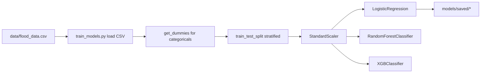

# Project Scan

## Scope
- Workspace scanned: `flood_prediction_system/`
- Scan type: inventory and architecture overview

## Structure
- `flood_prediction_system/data/`
  - `flood_data.csv`
- `flood_prediction_system/models/`
  - `flood_model.py`
  - `saved/`
    - `feature_names.pkl`
    - `logistic_regression_model.pkl`
    - `preprocessor.pkl`
- `flood_prediction_system/results/`
  - `class_distribution.png`
  - `confusion_matrix.png`
  - `model_comparison.png`
  - `training_report.txt`
- `flood_prediction_system/utils/`
  - `data_generator.py`
  - `preprocessing.py`
  - `real_time_prediction.py`
- `flood_prediction_system/visualization/`
  - `visualizer.py`
- Top-level code
  - `flood_prediction_system/config.py`
  - `flood_prediction_system/train_models.py`

## Stack Summary
- Language: Python
- ML/data libraries:
  - `pandas`
  - `numpy`
  - `scikit-learn`
  - `xgboost`
- Visualization:
  - `matplotlib`
  - `seaborn`
- Serialization / stdlib:
  - `pickle`
  - `os`
  - `pathlib`

## Training Flow
- Main entrypoint: `flood_prediction_system/train_models.py`
- Input data: `flood_prediction_system/data/flood_data.csv`
- Dataset target used by training: `flood_label`
- Preprocessing sequence:
  - load CSV with `pandas`
  - split features/target
  - one-hot encode categorical columns with `pd.get_dummies(...)`
  - split into train/test with `train_test_split(..., stratify=y)`
  - scale with `StandardScaler`
- Models trained:
  - Logistic Regression
  - Random Forest
  - XGBoost
- Metrics printed:
  - accuracy
  - precision
  - recall
  - F1
  - ROC-AUC
- Saved artifacts:
  - `models/saved/logistic_regression_model.pkl`
  - `models/saved/preprocessor.pkl`
  - `models/saved/feature_names.pkl`

## Inference Flow
- Main inference helper: `flood_prediction_system/utils/real_time_prediction.py`
- `PredictionEngine` loads:
  - `logistic_regression_model.pkl`
  - `preprocessor.pkl`
  - `feature_names.pkl`
- Prediction behavior:
  - accepts either an array-like input or a `dict`
  - if a `dict` is passed, it aligns values to saved `feature_names`
  - missing feature keys default to `0`
  - scales features with the saved preprocessor
  - returns predicted class, flood/no-flood probabilities, and confidence
- Risk labels:
  - `< 0.3` -> `Low`
  - `< 0.7` -> `Medium`
  - otherwise -> `High`

## Artifacts Present
- Dataset:
  - `data/flood_data.csv`
- Saved model bundle:
  - `models/saved/logistic_regression_model.pkl`
  - `models/saved/preprocessor.pkl`
  - `models/saved/feature_names.pkl`
- Generated result files:
  - `results/class_distribution.png`
  - `results/confusion_matrix.png`
  - `results/model_comparison.png`
  - `results/training_report.txt`

## Inconsistencies And Risks
- `config.py` defines `TARGET_COLUMN = 'flood'`, but `train_models.py` hardcodes `flood_label`.
- `utils/data_generator.py` creates a target column named `flood`, which does not match the training script's `flood_label` expectation.
- `config.py` is largely not wired into `train_models.py`, so configuration values are not acting as the single source of truth.
- `models/flood_model.py` looks like an alternate training/evaluation abstraction, but it is not used by `train_models.py`.
- `models/flood_model.py` exposes `save_best_model()` and a `preprocessor` field, but the preprocessing lifecycle is not actually wired there.
- `results/training_report.txt` lists `results/feature_importance.png` as generated, but that file is not present in `results/`.
- Only the logistic regression model is persisted by `train_models.py` even though three models are trained.

## Quick Read
- This is a compact Python ML project for flood-risk classification.
- The working path today is: CSV dataset -> preprocessing -> train 3 classifiers -> save logistic regression bundle -> run inference through `PredictionEngine`.
- The main cleanup opportunity is consistency: target-column naming, config usage, and alignment between the standalone training script and the class-based model module.
